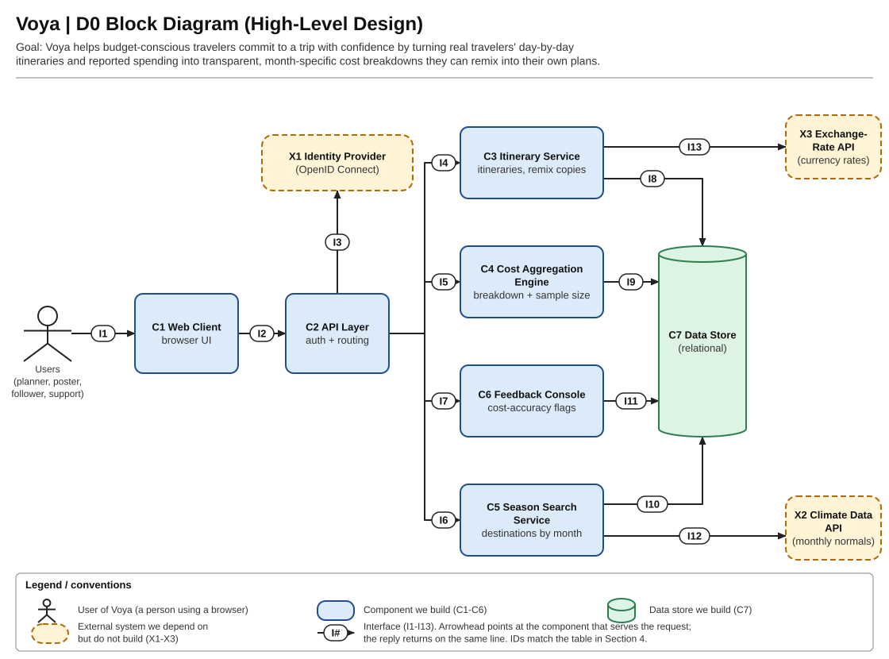
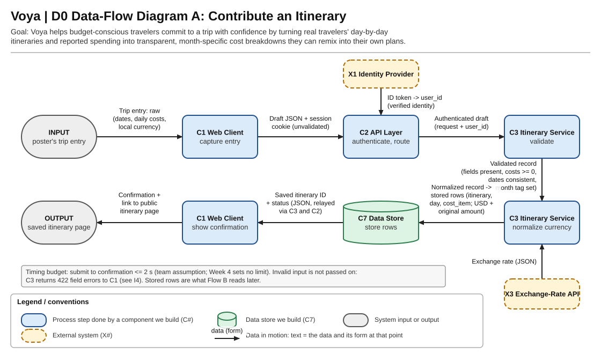
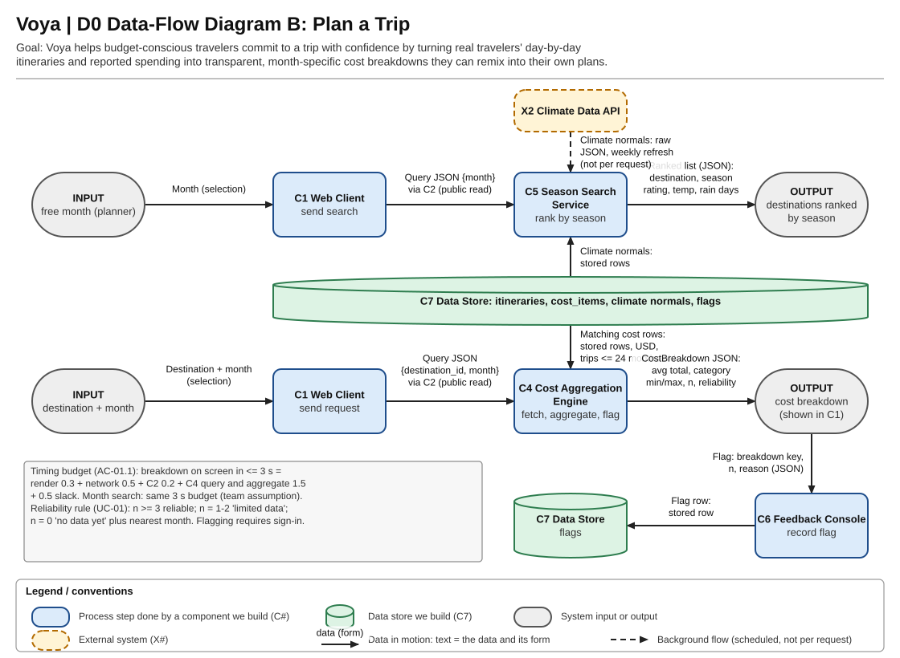

# 1. Title, goal statement, and conventions

Voya - D0 High-Level Design

Design D0 | Assignment #4 | October 2, 2026

Team: Tessneem Khalil and Salwa Syed

Goal: Voya is a social platform for travelers to share trip reviews, recommendations, itineraries, and costs in one place. People can see where others traveled during different months and use their experiences to plan a trip that fits their budget.

Basic input: Travelers post where they went, when they went, their reviews, recommendations, daily plans, and spending. People planning a trip choose a destination and month, or search by the month they are free. Basic output: Voya shows travelers' posts, editable copies of their plans, monthly cost estimates with the number of trips used, and destinations that fit the selected season.

Conventions: Blue rounded boxes are built components. Green cylinders are the relational data store. Dashed amber boxes are external providers. The person symbol represents users. In the block diagram, an arrow points to the request-serving component, with the reply returning on the same interface. I1-I13 identify the contracts in Part 4. Data-flow arrows instead show the data and its form at each stage, and dashed flow lines show scheduled background work. Every supplied diagram includes its own title, goal, and legend.

Scope: D0 defines boundaries and contracts, without algorithms, class names, implementation libraries, or vendor selections. C3-C6 are logical server modules, not separate deployments.

User story coverage: This design covers US-01 through US-05: viewing costs, sharing trip details, copying an itinerary, searching by month, and explaining estimates using the number of trips. Reviews and recommendations are part of the trip post in US-02. Tessneem Khalil and Salwa Syed are the primary owners listed in Part 3.

# 2. Block diagram (the D0 diagram)



Voya uses the same posted trip details for social sharing and planning. Seven built components (C1-C7) communicate over 13 labeled interfaces. X1-X3 are external dependencies. C2 is the entry point to server capabilities. C7 is accessed only by server modules.

# 3. Component responsibility table

| Component | One-sentence responsibility | Interfaces | Primary owner | User story |
| --- | --- | --- | --- | --- |
| C1 Web Client | Shows the travel platform in the browser. | In: I1. Out: I2 | Tessneem Khalil | US-01-US-05 |
| C2 API Layer | Controls access to server capabilities. | In: I2. Out: I3-I7 | Salwa Syed | US-01-US-05 |
| C3 Itinerary Service | Manages travel posts and editable trip plans. | In: I4. Out: I8, I13 | Tessneem Khalil | US-02, US-03 |
| C4 Cost Aggregation Engine | Builds cost estimates for a destination and month. | In: I5. Out: I9 | Salwa Syed | US-01, US-05 |
| C5 Season Search Service | Finds destinations that fit a travel month. | In: I6. Out: I10, I12 | Salwa Syed | US-04 |
| C6 Feedback Console | Manages cost-accuracy reports. | In: I7. Out: I11 | Tessneem Khalil | US-05 (plus complaint-reporting support) |
| C7 Data Store | Stores the platform's trip and planning data. | In: I8-I11. Replies on same IDs | Salwa Syed | US-01-US-05 |

The interfaces show requests. Responses use the same ID. Every story connects to at least one component. C3 stores reviews and recommendations with the itinerary, so the social posts also support budget planning. US-03 covers copying a traveler's itinerary into an editable plan. C6 is a small team-managed complaint view, since Voya does not have a formal support team.

# 4. Interface specification table

The contracts below define every block-diagram connection. Types: string, integer, boolean, decimal, date (YYYY-MM-DD), timestamp (UTC ISO 8601), enum, object, and array. Money uses decimal values. Month is integer 1-12. IDs are opaque strings. Inputs and outputs below are logical fields, not final database schema.

| Interface | Named, typed input | Named, typed output | Format | Protocol | Error behavior / handler |
| --- | --- | --- | --- | --- | --- |
| I1 Users → C1 | trip_entry: object, selection: object, action: enum | page: rendered view, field_errors: string[] | UI fields / browser events | Local browser interaction | C1 preserves drafts, shows validation or accessible retry messages. |
| I2 C1 → C2 | operation: enum, payload: object, session: opaque cookie for writes | status: integer, data: object or array, error: {code:string, message:string, fields:object} | JSON, session cookie | HTTPS request/reply | C2 returns 400/401/403/422/503. C1 displays errors and keeps entered data. |
| I3 C2 → X1 | authorization_code:string, redirect_uri:string, state:string, verifier:string | id_token:string, subject:string, expires_at:timestamp, signing_keys:object | OIDC JSON, signed token | OpenID Connect over HTTPS | C2 checks issuer, audience, expiry and state. Rejects invalid identity (401), provider outage (503). No write allowed. |
| I4 C2 → C3 | operation: create/read/remix, user_id:string for writes, draft:TripDraft (includes review and recommendations) or itinerary_id:string | itinerary:object or saved_id:string, status:enum, field_errors:object | Typed request/result object | In-process module call | C3 validates dates, nonnegative costs and ownership. Returns 422/403/404 via C2. No partial save. |
| I5 C2 → C4 | destination_id:string, month:integer | average_total_usd:decimal?, categories:object[], n:integer, reliability:enum, nearest_month:integer? | Typed request/result object | In-process module call | C4 rejects invalid month (422). No matches returns no_data with nearest available month. If no month has data, explains that none is available. Storage failure becomes 503 through C2. |
| I6 C2 → C5 | month:integer | destinations:{id:string, season_rating:enum, temp_c:decimal, rain_days:decimal}[], data_as_of:timestamp | Typed request/result object | In-process module call | C5 returns 422 for invalid month. Uses last valid climate rows with age label. Unavailable rows return 503 via C2. |
| I7 C2 → C6 | user_id:string, operation:submit/review, breakdown_key:object, n:integer, reason:string, flag_id:string? | flag_id:string, status:enum, flags:object[] for authorized review | Typed request/result object | In-process module call | C6 returns 422 for invalid reason, 403 for unauthorized support review, 404 for missing flag. C2 relays. |
| I8 C3 → C7 | operation:read/write/remix, itinerary:object, days:object[], cost_items:object[] | rows:object[] or saved_id:string, committed:boolean | Parameterized statements, typed rows | Database connection / transaction | C7 rolls back failed writes. C3 translates storage failures to 503. Remix preserves source and creates a new owned copy. |
| I9 C4 → C7 | destination_id:string, month:integer, cutoff:date (24 months) | cost_rows:{trip_id:string, category:enum, amount_usd:decimal, trip_date:date}[] | Parameterized query, typed rows | Database connection / read | C4 counts distinct completed itineraries. Empty rows yield n=0. Connection/query failure becomes 503. |
| I10 C5 → C7 | operation:read/upsert, month:integer, climate_rows:object[] for refresh | normals:{destination_id:string, month:integer, temp_c:decimal, rain_days:decimal, fetched_at:timestamp}[], saved_count:integer | Parameterized statements, typed rows | Database connection / transaction | C5 retains previous valid rows on failed refresh. Rolls back partial upsert. Read failures become 503. |
| I11 C6 → C7 | operation:insert/list/update, flag:{user_id:string, breakdown_key:object, n:integer, reason:string, status:enum} | flag_id:string, flags:object[], saved:boolean | Parameterized statements, typed rows | Database connection / transaction | C7 rolls back write failures. C6 reports 503, retains retry context, and does not claim flag was saved. |
| I12 C5 → X2 | destination_id:string, month:integer or all-month request | normals:{month:integer, temp_c:decimal, rain_days:decimal}[], source:string, as_of:timestamp | Provider JSON mapped to Voya fields | HTTPS, weekly background refresh | C5 validates units/ranges. Timeout, malformed data or rate limit keeps previous rows and schedules retry. No per-request provider call. |
| I13 C3 → X3 | base_currency:string, quote_currency:USD, rate_date:date | rate:decimal, effective_date:date, source:string | Provider JSON mapped to Voya fields | HTTPS request/reply | C3 requires a positive dated rate. Missing/failed conversion returns 503 and preserves draft in C1. No unmarked guessed rate or partial save. |

Common error response: {"code":"VALIDATION_ERROR","message":"Check the trip dates.","fields":{"end_date":"Must be on or after start_date."}}. C2 maps module results to HTTP status codes and avoids exposing tokens or internal database details.


Example I2 create-itinerary request. C2 adds verified user_id before I4. TripDraft contains destination_id:string, start_date:date, end_date:date, visibility:enum, review:string, recommendations:string[], days:array of {date:date, costs:array of {category:enum, amount:decimal, currency:string}}. Currency codes use three-letter identifiers. Category values: flights, lodging, food, activities, transport, other. Flights, lodging, food, and activities match UC-01.

```json
{
  "operation": "create_itinerary",
  "payload": {
    "destination_id": "lisbon",
    "start_date": "2026-06-10",
    "end_date": "2026-06-10",
    "visibility": "public",
    "review": "Lisbon was easy to explore in June.",
    "recommendations": [
      "Use public transportation."
    ],
    "days": [
      {
        "date": "2026-06-10",
        "costs": [
          {
            "category": "food",
            "amount": "25.00",
            "currency": "EUR"
          }
        ]
      }
    ]
  }
}
```

Example successful response: {"status":201,"data":{"saved_id":"trip_104","status":"saved"}}. Stored cost records retain the original amount/currency plus USD amount, rate date, and source. A remix request supplies source itinerary_id. C3 returns a new saved_id without changing the original.

A breakdown key is {destination_id:string, month:integer, generated_at:timestamp}. Category summaries include category:enum, average_usd:decimal, min_usd:decimal, max_usd:decimal. Null average_total_usd means no observations, not a zero-cost trip. Reliability values are reliable (n >= 3 distinct trips), limited_data (n = 1-2), and no_data (n = 0).

# 5. Data-flow diagram



Flow A: the traveler enters trip details, a review, recommendations, and costs. C2 verifies identity through I3. C3 validates through I4 and obtains dated currency rates through I13. I8 commits normalized records. Confirmation returns through C3, C2, and C1. The two-second submission target is a team assumption, not a supplied requirement.




Flow B: public selections pass through I2, then I6 for seasonal results or I5 for costs. C5 uses I10 and refreshes climate data weekly through I12. C4 reads I9. Signed-in flags pass through I7 and I11. The supplied AC-01.1 budget is <= 3 seconds. The same month-search target is an assumption.

# 6. Architecture pattern and justification

Chosen patterns: Client-server governs the browser-to-API boundary (C1-C2). Layered architecture governs the server: C2 access boundary, C3-C6 domain capabilities, and C7 persistence. A logical pipeline describes contribution stages (capture, verify, validate, normalize, persist). It does not imply separate processes or a streaming platform.

| Criterion | Justification |
| --- | --- |
| Fit to the problem | A shared server lets travelers publish reviews and recommendations while other users browse trips and plan their own. Separate layers keep the page, access checks, trip features, and stored data organized. |
| Team skills | For a two-person team, one server with separate modules is easier to build and test. Tessneem and Salwa can divide the work without maintaining several deployments. Language and framework choices will be made in D1/D2. |
| Performance and timing | Cost requests read local USD rows. Climate provider calls are outside the interactive path. AC-01.1 requires results within 3 seconds. Our proposed budget is 0.3 s render + 0.5 s network + 0.2 s C2 + 1.5 s C4 query/aggregation + 0.5 s slack = 3 s. Validate this budget under representative load in later designs. |
| Scalability | A single modular server is a manageable starting point. If demand grows, server instances can scale behind the same API, with shared persistence. Separate deployment of heavy modules is a future option, not a D0 requirement. |
| Hardware constraints | Voya needs a browser, network access, hosted server, and database. No sensors or actuators appear in the diagrams. Users access the platform through a standard browser. The design uses standard hosted computing resources without custom hardware. |

Design constraints: prioritize low-cost shared hosting. Store provider subject identifiers rather than passwords. Keep credentials server-side. Support keyboard navigation, labeled fields, and text equivalents for reliability colors. Voya does not need location traces or booking and payment details for these user stories. Public itineraries should omit private account details. These choices keep hosting costs manageable and limit the personal information stored by Voya.

Rejected pattern: independently deployed microservices add network hops, service authentication, monitoring, and deployment overhead before scale is demonstrated. A purely browser-only design was also rejected because shared persistence and trusted authenticated writes require a server boundary. Embedded sensor-actuator architecture does not fit the stated inputs.

# 7. Decision log

| Decision | Alternatives considered | Why the chosen option won |
| --- | --- | --- |
| D01: Browser client + layered modular server | Browser-only. Independently deployed microservices | Supports shared data and trusted writes with fewer deployment boundaries. Preserves module separation for future growth. |
| D02: Relational shared persistence (C7) | Document storage. Local browser storage | Trips, days, costs, and flags have related records. Transactions prevent partially published itineraries. Final schema belongs in D1/D2. |
| D03: Normalize costs to USD at contribution time. Retain originals | Convert during every read. Retain only converted values | Keeps cost requests independent of rate-provider latency. Original amounts and rate provenance remain available for explanation. Failed conversion does not publish incomplete data. |
| D04: Refresh climate normals weekly into C7 | Call X2 for each search. Embed fixed climate values | Keeps provider latency and quota failures outside interactive search while maintaining refreshable results with an age label. |
| D05: Delegate identity to X1. Gate writes at C2 | Build password authentication. Anonymous writes | Keeps identity verification at one boundary. Public planning stays available while itinerary writes, flags, and support review require appropriate access. Provider choice remains open. |
| D06: Expose sample size and limited/no-data states | Always show a precise estimate. Hide results below three trips | Preserves the supplied UC-01 behavior: n >= 3 reliable, n = 1-2 limited, n = 0 no data with nearest-month suggestion. These labels do not guarantee statistical accuracy. |
| D07: Create a new itinerary for each remix | Modify the source itinerary. Keep only a client draft | Preserves source authorship and gives the planner an independently editable copy under C3 ownership checks. |
